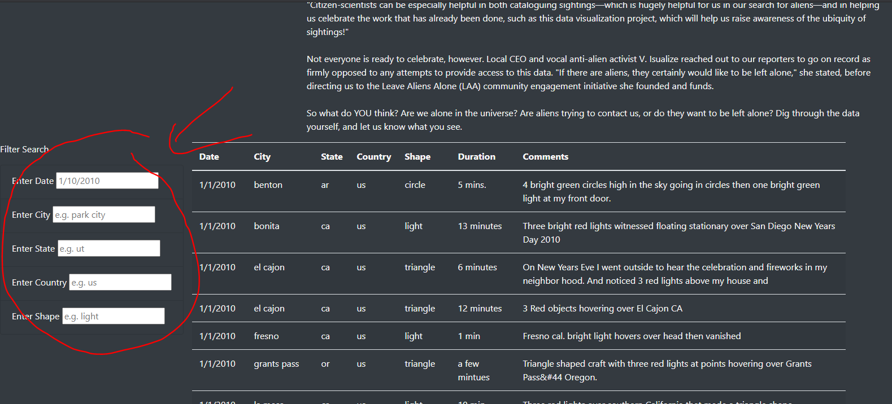
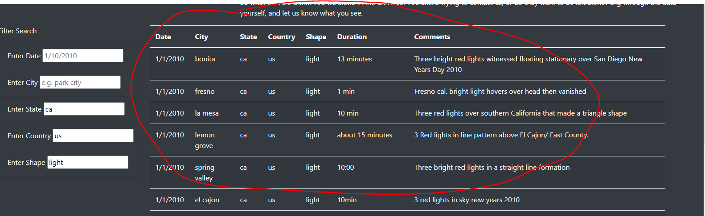
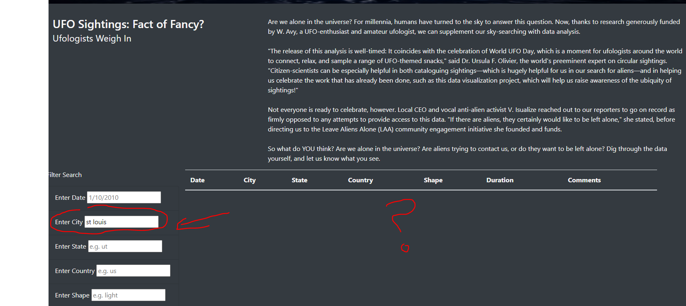

# UFOs
Javascript (ECMAScript) Data Analysis and Bootstrap Web Customization.

## Overview
This web application was designed with Javascript (ECMAScript) to easily read and interpret UFO sighting data. The purpose of it is for information gathering, and creating an intuitive UI for searching UFO sightings. 

### Technologies Used
- Javascript (with D3)
- HTML / CSS

## Results

### How to Use The Web Application
To use the webpage, one must do the following:
1. Enter desired input

In this case, any of the input fields can be filled, depending on how specific one would like to be. In this example, we will fill the state, country, and shape fields with "ca", "us" and "light", to find light shaped sightings that happened in the state of California in the US.  
2.  Click on page to view results 

Once the input has been entered, you will see the results refresh in the table. You will have to click on the screen to tell the web application that you've finished entering input, however. Note: If you're filtering multiple times, you'll need to clear the inputs that you've already entered before continuing, for the table's query will specify all criteria entered in the boxes.

## Conclusions / Summary 

### Drawbacks
During this development, we found some definitive drawbacks to the web application, but the biggest one was the query syntax. Due to the nature of the query, this web application searches for exact matches, meaning that the city names have to be spelled correctly and labeled with all characters present. This became an issue for querying cities such as St. Louis, where sometimes people search its name without including the period mark. 

As a result, St. Louis is often harder to query, and with the way the application is set up, can easily get overlooked. To fix this, a more fuzzier matching query would be advisable - instead of exact matches, adding a "contains" clause instead of "equal to" clause would help. In that case, one could search "louis" and still get results for St. Louis.

### Recommendations for Improvement
There are many things we could do to further legitimize this web application. For example:
- <strong>A more interactive interface:</strong> There are many aesthetic changes that could be made to make the site more intuitive. For example, adding filters to sort columns would enhance the user experience greatly, for one could better interpret how findings may differ based on different fields, such as shape.  
- <strong>More data:</strong>- country seems a bit extraneous! By adding more and various country data, we could make better use of the full picture. In this case, only the US's data was provided, which meant that the input field for "country" was not needed. As well as this, the date range could be larger, so that we could view how this data has changed over time. It seems as though adding more data, assuming that it is clean and accurate, could only help us in this case.
